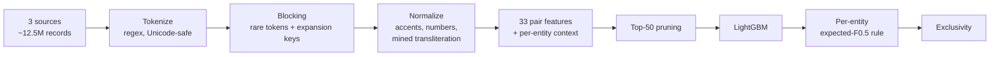

# Business Entity Resolution at Scale

Match 2.2M businesses against 10.3M records from two other sources, across three countries,
on a single 32 GB machine. Built for the Amazon ML Challenge.

| | Macro F0.5 |
|---|---|
| Public leaderboard | **0.934** (up from 0.820 for the first submission) |
| Held-out validation (331K entities) | **0.9605** (US 0.968, India 0.949) |

**Stack:** Python, DuckDB (out-of-core SQL), LightGBM, `regex`, RapidFuzz. No external APIs,
no pretrained models.

## The problem

For each Source 1 (S1) business, return every Source 2/Source 3 record that describes the same
business. A business can have zero or up to 11 matches. The score is macro-averaged F0.5 per
entity: precision counts twice as much as recall, and a single false match on a business
that has no matches scores 0.

**Start with [`notebooks/00_data_and_challenges.ipynb`](notebooks/00_data_and_challenges.ipynb).**
It goes through the raw data and sets out the nine challenges the pipeline is built around:

1. Set prediction. The model decides how many matches each business gets, including none.
2. Exclusivity. No record belongs to two businesses.
3. 14% of true matches share no name token.
4. Addresses almost never match exactly, but their tokens overlap.
5. Generic chain names repeat hundreds of times.
6. Indian-script names (`प्राइवेट लिमिटेड`), which Python's `re` `\w+` also breaks apart.
7. Street and unit numbers tell look-alikes apart.
8. F0.5 rewards restraint.
9. France appears only in test, with no labels.

## Approach



- **Blocking.** Each record keeps its 5 rarest tokens per field, and candidates come from
  shared rare tokens. Three expansion keys (equal normalized name, word-sorted name, shared
  rare address number) raise the validation recall ceiling from 0.962 to 0.971. On test this
  produces 336M candidate pairs.
- **Transliteration mined from labels.** External services were not allowed. Instead, the
  tokens of equal-length Latin and Indian-script names are aligned across true pairs, which
  gives 1,498 mappings (`ಕನ್ಸಲ್ಟಿಂಗ್ → consulting`, `પ્રા → pvt`).
- **Features aimed at look-alikes.** IDF of the rarest *unshared* token, number conflicts,
  and each candidate's rank and score gap within its entity. The entity-context features
  carry the most model gain.
- **Decision rule.** Probabilities are calibrated, and each entity keeps the top-k candidates
  (k from 0 to 25) that maximize its expected F0.5. Each S2/S3 record then goes to at most one
  S1 entity.

Full write-up: [`docs/methodology.md`](docs/methodology.md).

## What each version added

| Version | Main change | Validation F0.5 |
|---|---|---|
| v1 | base features | 0.688 |
| v2 | corrected token-set Jaccard | 0.8605 (leaderboard 0.820) |
| v3 | address-number features | 0.9022 |
| v4 | normalized-string features, leading-zero fix | 0.9295 |
| **v5** | blocking expansion, transliteration, IDF-mismatch and context features, learned decision rule | **0.9543** raw / **0.9605** adjusted (leaderboard **0.934**) |

"Adjusted" drops validation candidates that belong to S1 entities outside the validation split.
On test, every entity competes for its records, so this is the closer estimate.

## Engineering notes

- **Out-of-core on 32 GB.** Every heavy step runs in `hash(s1_entity_id)` buckets. A bucket
  that runs out of memory is split into 4 and retried automatically. Steps record themselves
  in a `step_done` table, so an interrupted run resumes where it stopped.
- **A 207 GB spill.** A single join from ground-truth pairs to raw strings spilled 207 GB to
  disk before failing. Filtering to the ~750K Indian-script candidates first and sampling
  400K pairs produced the same dictionary in 5 seconds.
- **A hash collision.** Training entities were sampled with `hash % 8 = 0`, and features were
  bucketed with the same hash, so all 44M training pairs landed in one bucket. Salting the
  bucketing hash fixed it.

## Limitations and next steps

- **France (about 15% of test) has no labels.** Assuming the US and India score on test what
  they score on validation, France comes out at about 0.80, which accounts for most of the
  validation-to-leaderboard gap. Next steps: self-training on confident French matches, plus
  French address and legal-form normalization (`rue`/`bd`, postcodes, `SARL`/`SAS`).
- Transliteration only covers tokens seen in training pairs.
- Refitting on train plus validation (2.4 times the labels) left the leaderboard score
  unchanged. The remaining error is not a lack of data.

## Repository layout

```
notebooks/00_data_and_challenges.ipynb       data exploration: the 9 challenges
notebooks/01_blocking_and_base_features.ipynb  stage 1: load, tokenize, block, base tables
src/pipeline_v5.py                           stages 2-9: normalization -> features -> model -> output
docs/methodology.md                          full methodology
data/README.md                               where the data goes (not included)
```

## Running it

The dataset is not redistributed (see [`data/README.md`](data/README.md)). This was tested on
AWS SageMaker ml.t3.2xlarge (8 vCPU, 32 GB RAM, ~200 GB free disk), Python 3.10.

```bash
pip install -r requirements.txt
# place the challenge data under $DATA_ROOT/dataset/{train,test}/ ; paths are set at the top of each file
jupyter nbconvert --to notebook --execute notebooks/00_data_and_challenges.ipynb   # optional EDA, ~10 min
jupyter nbconvert --to notebook --execute notebooks/01_blocking_and_base_features.ipynb
python src/pipeline_v5.py      # resumable; writes matching_results_v5.tsv and candidate_pairs_v5.tsv
```

## License

Code: MIT (see `LICENSE`). The challenge dataset belongs to its organisers and is not covered by this license.
The notebooks show a few sample rows for illustration only.
